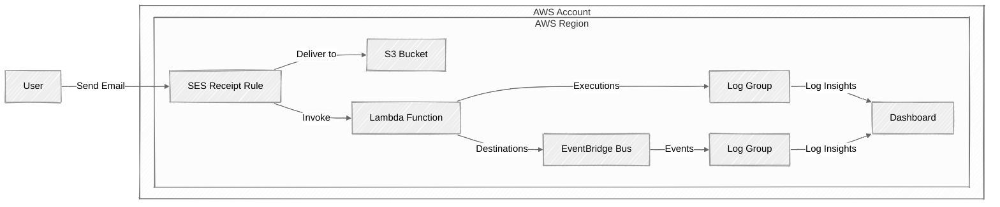

# Email Wrangler

AWS serverless solution to extract document attachements from e-mails sent to a virtual mailbox. The solution relies on integration of following AWS services: SES + S3 + Lambda + EventBridge + CloudWatch. This repository is an AWS Cloud Development Kit (AWS CDK) application written in TypeScript.

## How it works?

Solution walkthrough:

1. User sends an e-mail with attachments to SES Email Retrieval endpoint (receiving mailbox)
2. SES Receipt Rule saves messages as EML files to S3 bucket in the `incoming/` folder
3. SES Receipt Rule invokes the Lambda function and passes metadata about EML file in context
4. Lambda function loads the EML file from S3 bucket, extracts document attachments (selected content type), and saves them back to S3 bucket in the `attachments/` folder.
5. Lambda execution logs are streamed to a dedicated CloudWatch Log Group
6. EventBridge custom Bus is configured as Lambda Destination to collect events emitted on Lambda function's successful and failed executions
7. EventBridge Rule target is configured to stream the events to a dedicated CloudWAtch Log Group
8. CloudWatch Dashboard uses CloudWatch Log Insights to query for execution and destination logs to show number of successfull or failed Lambda function executions, as well as number of extracted document attachments from the EML files.

Solution diagram:



## How to deploy it?

Prerequisites:

- Amazon Route 53 Public Hosted Zone defined in your AWS Account
  - You can purchase a new domain in Amazon Route 53: https://docs.aws.amazon.com/Route53/latest/DeveloperGuide/domain-register.html 
  - You can delegate a subdomain from your domain registrar to Route 53 Name Servers: https://docs.aws.amazon.com/Route53/latest/DeveloperGuide/dns-configuring-new-domain.html

1. Identify your existing Route 53 Public Hosted Zone, for example: 

```
aws.serverless.ninja
```

2. Update content of the `cdk.context.json` JSON file: `domain` should match your domain, and `mailbox` can be any e-mail address under your domain, which will be used to receive e-mails (receiving mailbox), for example:

```json
{
  "config": {
    "domain": "aws.serverless.ninja",
    "mailbox": "documents@aws.serverless.ninja"
  }
}
```

3. Authenticate to AWS and store your static/temporary credentials in AWS CLI Profile: https://docs.aws.amazon.com/cli/v1/userguide/cli-configure-files.html

Export environment variables for your AWS CLI configuration, these variables will be used by AWS CDK to identify the AWS account and region for deployments, for example:

```bash
export AWS_PROFILE=123456789012_DeveloperRole
export AWS_REGION=eu-west-1
```

4. Run the following CLI commands to build, synthesize, and **deploy** the CDK App (to create/update CF stacks in your AWS account)

Install and build NPM packages:

```bash
npm install
npm run build
```

Synthesize and deploy AWS CDK App:

```bash
npx cdk synth --all
npx cdk deploy --all
```

The CDK app will deploy single CloudFormation stack called `EmailWranglerStack`.

## How to modify it?

EventBridge Bus receives events from Lambda Destinations for successfull and failed executions of Lambda function. You can create an extra Event Rule to catch only the successful executions.

Make sure to input the `$.detail.documents` (JSON Path) to the Event Target. This is to pass to the target service (for example Step Functions workflow) only part of the event: output of the Lambda function.

## How to clean it up?

Run the following CLI command to **destroy** the CDK App (to remove CF stacks from your account)

```bash
npx cdk destroy --force
```

Alternatively, open AWS Management Console -> CloudFormation -> Stacks, and simply delete the CloudFormation stack called `EmailWranglerStack`.
